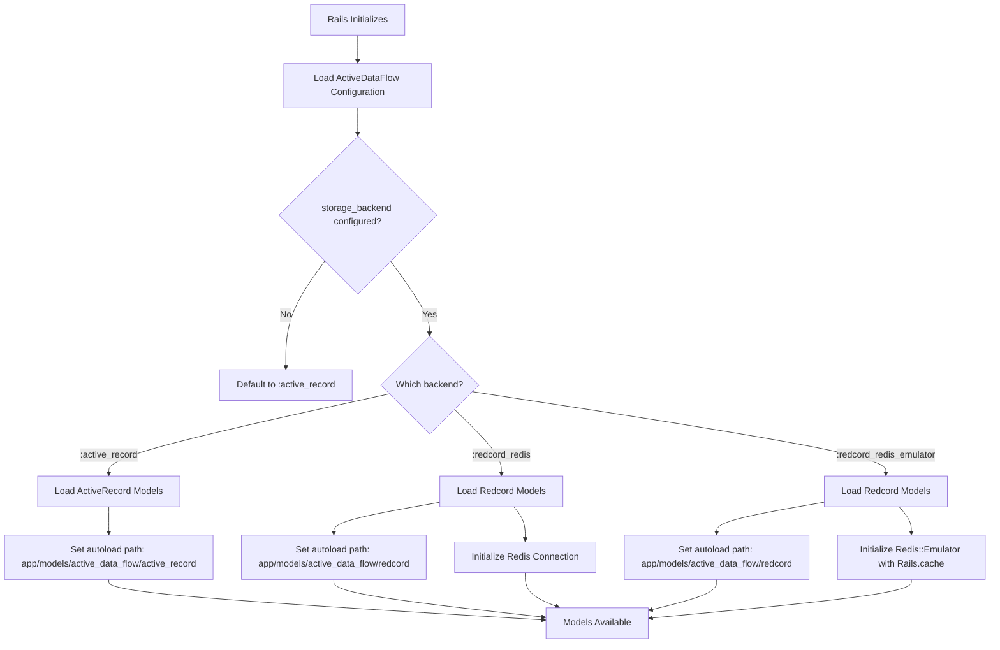

# Design Document

## Overview

This design implements configurable storage backend support for the ActiveDataFlow gem. The system will allow users to choose between ActiveRecord (SQL databases), Redcord with standard Redis, or Redcord with redis-emulator (backed by Rails Solid Cache) as the persistence layer for DataFlow and DataFlowRun models.

The design maintains backward compatibility with existing ActiveRecord installations while enabling Redis-based storage for applications that prefer key-value storage or want to avoid SQL database dependencies.

See: `.kiro/specs/configurable-storage-backend/requirements.md` for detailed requirements
See: `.kiro/glossary.md` for term definitions

## Architecture

### High-Level Architecture

```
┌─────────────────────────────────────────────────────────┐
│                    Rails Application                     │
├─────────────────────────────────────────────────────────┤
│              config/initializers/                        │
│              active_data_flow.rb                         │
│              (User Configuration)                        │
├─────────────────────────────────────────────────────────┤
│                  ActiveDataFlow Engine                   │
│  ┌────────────────────────────────────────────────────┐ │
│  │  Configuration Module                              │ │
│  │  - storage_backend: :active_record (default)       │ │
│  │  - storage_backend: :redcord_redis                 │ │
│  │  - storage_backend: :redcord_redis_emulator        │ │
│  │  - redis_config: { ... }                           │ │
│  └────────────────────────────────────────────────────┘ │
│  ┌────────────────────────────────────────────────────┐ │
│  │  Storage Backend Loader                            │ │
│  │  - Reads configuration                             │ │
│  │  - Sets up autoload paths                          │ │
│  │  - Initializes Redis connection (if needed)        │ │
│  └────────────────────────────────────────────────────┘ │
├─────────────────────────────────────────────────────────┤
│                   Model Implementations                  │
│  ┌──────────────────┐  ┌──────────────────────────────┐ │
│  │  ActiveRecord    │  │  Redcord                     │ │
│  │  Models          │  │  Models                      │ │
│  │                  │  │                              │ │
│  │  DataFlow        │  │  DataFlow                    │ │
│  │  DataFlowRun     │  │  DataFlowRun                 │ │
│  │                  │  │                              │ │
│  │  (SQL DB)        │  │  (Redis / Redis Emulator)    │ │
│  └──────────────────┘  └──────────────────────────────┘ │
└─────────────────────────────────────────────────────────┘
```

### Storage Backend Selection Flow



## Components and Interfaces

### 1. Configuration Module Enhancement

**Purpose**: Extend the existing Configuration class to support storage backend options

**Location**: `lib/active_data_flow/configuration.rb`

**New Attributes**:
- `storage_backend` (Symbol): One of `:active_record`, `:redcord_redis`, `:redcord_redis_emulator`
- `redis_config` (Hash): Redis connection configuration (for `:redcord_redis` only)

**Methods**:
- `validate_storage_backend!`: Validates the configured backend is supported
- `active_record?`: Returns true if using ActiveRecord backend
- `redcord?`: Returns true if using any Redcord backend
- `redcord_redis?`: Returns true if using standard Redis
- `redcord_redis_emulator?`: Returns true if using redis-emulator

**Default Configuration**:
```ruby
def initialize
  @auto_load_data_flows = true
  @log_level = :info
  @data_flows_path = "app/data_flows"
  @storage_backend = :active_record  # NEW
  @redis_config = {}                  # NEW
end
```

See: Requirement 1

### 2. Storage Backend Loader

**Purpose**: Load the appropriate model implementations based on configuration

**Location**: `lib/active_data_flow/storage_backend_loader.rb` (new file)

**Responsibilities**:
- Read storage_backend configuration
- Validate required gems are installed
- Set up autoload paths for the correct model directory
- Initialize Redis connection for Redcord backends
- Provide clear error messages for configuration issues

**Methods**:
- `self.load!`: Main entry point, called during engine initialization
- `self.setup_autoload_paths(engine)`: Configure Rails autoload paths
- `self.initialize_redis_connection`: Set up Redis for Redcord backends
- `self.validate_dependencies!`: Check required gems are installed

**Pseudocode**:
```ruby
def self.load!
  config = ActiveDataFlow.configuration
  config.validate_storage_backend!
  
  case config.storage_backend
  when :active_record
    validate_active_record_dependencies!
    # ActiveRecord models loaded automatically via Rails conventions
  when :redcord_redis
    validate_redcord_dependencies!
    initialize_redis_connection
  when :redcord_redis_emulator
    validate_redis_emulator_dependencies!
    initialize_redis_emulator
  end
end
```

See: Requirements 1, 5, 9

### 3. ActiveRecord Model Implementations

**Purpose**: SQL database-backed models (existing implementation)

**Location**: `app/models/active_data_flow/active_record/`

**Structure**:
- `app/models/active_data_flow/active_record/data_flow.rb`
- `app/models/active_data_flow/active_record/data_flow_run.rb`

**Implementation**: Move existing models from `app/models/active_data_flow/` to this subdirectory

**Key Features**:
- Inherit from `ApplicationRecord`
- Use standard ActiveRecord associations
- Support SQL queries and scopes
- Use Rails migrations for schema

See: Requirement 2

### 4. Redcord Model Implementations

**Purpose**: Redis-backed models using Redcord

**Location**: `app/models/active_data_flow/redcord/`

**Structure**:
- `app/models/active_data_flow/redcord/data_flow.rb`
- `app/models/active_data_flow/redcord/data_flow_run.rb`

**Base Implementation**:
```ruby
module ActiveDataFlow
  module Redcord
    class DataFlow
      include ::Redcord::Base
      
      # Schema definition
      attribute :name, :string
      attribute :source, :string  # JSON serialized
      attribute :sink, :string    # JSON serialized
      attribute :runtime, :string # JSON serialized
      attribute :status, :string
      attribute :next_source_id, :string
      attribute :last_run_at, :integer  # Unix timestamp
      attribute :last_error, :string
      attribute :created_at, :integer
      attribute :updated_at, :integer
      
      # Indexes
      range_index :name
      range_index :status
      range_index :created_at
      
      # Associations (Redcord style)
      has_many :data_flow_runs, dependent: :destroy
      
      # ... rest of methods matching ActiveRecord interface
    end
  end
end
```

**Key Features**:
- Include `Redcord::Base`
- Define schema using Redcord DSL
- Implement same public interface as ActiveRecord models
- Handle JSON serialization for complex attributes
- Use Unix timestamps for datetime fields

See: Requirements 3, 3a, 4

### 5. Model Interface Abstraction

**Purpose**: Ensure consistent interface across storage backends

**Approach**: Both ActiveRecord and Redcord implementations must provide:

**Common Methods**:
- `find_or_create(name:, source:, sink:, runtime:)`
- `interval_seconds`
- `enabled?`
- `run_one(message)`
- `run_batch`
- `next_due_run`
- `schedule_next_run(from_time)`
- `mark_run_started!(run)`
- `mark_run_completed!(run)`
- `mark_run_failed!(run, error)`
- `run`
- `heartbeat_event`

**Common Scopes**:
- `active`
- `inactive`
- `due_to_run`
- `pending`
- `in_progress`
- `success`
- `completed`

**Common Validations**:
- Presence of name, source, sink
- Uniqueness of name
- Status inclusion validation

See: Requirement 4

### 6. Redis Connection Management

**Purpose**: Initialize and manage Redis connections for Redcord backends

**For `:redcord_redis`**:
```ruby
def self.initialize_redis_connection
  config = ActiveDataFlow.configuration.redis_config
  
  redis_client = Redis.new(
    url: config[:url] || "redis://localhost:6379/0",
    host: config[:host],
    port: config[:port],
    db: config[:db]
  )
  
  Redcord.configure do |c|
    c.redis = redis_client
  end
  
  # Validate connection
  redis_client.ping
rescue Redis::CannotConnectError => e
  raise ActiveDataFlow::ConnectionError, 
        "Failed to connect to Redis: #{e.message}"
end
```

**For `:redcord_redis_emulator`**:
```ruby
def self.initialize_redis_emulator
  redis_emulator = Redis::Emulator.new(
    backend: Rails.cache
  )
  
  Redcord.configure do |c|
    c.redis = redis_emulator
  end
  
  # No connectivity check needed - uses Rails.cache
end
```

See: Requirement 7

### 7. Engine Integration

**Purpose**: Integrate storage backend loading into Rails engine initialization

**Location**: `lib/active_data_flow/engine.rb`

**Changes**:
```ruby
module ActiveDataFlow
  class Engine < ::Rails::Engine
    # ... existing configuration ...
    
    # NEW: Load storage backend before other initializers
    initializer "active_data_flow.load_storage_backend", before: :load_config_initializers do
      require "active_data_flow/storage_backend_loader"
      ActiveDataFlow::StorageBackendLoader.load!
    end
    
    # ... rest of existing initializers ...
  end
end
```

See: Requirement 5

### 8. Generator for Configuration File

**Purpose**: Generate configuration file with examples

**Location**: `lib/generators/active_data_flow/install_generator.rb`

**Command**: `rails generate active_data_flow:install`

**Generated File**: `config/initializers/active_data_flow.rb`

**Template Content**:
```ruby
# ActiveDataFlow Configuration
ActiveDataFlow.configure do |config|
  # Storage Backend Configuration
  # Choose one of: :active_record, :redcord_redis, :redcord_redis_emulator
  # Default: :active_record
  config.storage_backend = :active_record
  
  # === ActiveRecord Backend (default) ===
  # Uses your Rails database (PostgreSQL, MySQL, SQLite, etc.)
  # Requires: Standard Rails setup with database.yml
  # Migrations: Run `rails active_data_flow:install:migrations` and `rails db:migrate`
  
  # === Redcord Redis Backend ===
  # Uses a standard Redis server for storage
  # Requires: gem 'redis' and gem 'redcord'
  # config.storage_backend = :redcord_redis
  # config.redis_config = {
  #   url: ENV['REDIS_URL'] || 'redis://localhost:6379/0'
  #   # OR specify individual options:
  #   # host: 'localhost',
  #   # port: 6379,
  #   # db: 0
  # }
  
  # === Redcord Redis Emulator Backend ===
  # Uses redis-emulator backed by Rails Solid Cache (no separate Redis server needed)
  # Requires: gem 'redis-emulator' and gem 'redcord'
  # config.storage_backend = :redcord_redis_emulator
  # Note: Uses Rails.cache as backing store (configure in config/cache.yml)
  
  # Other configuration options
  config.auto_load_data_flows = true
  config.log_level = :info
  config.data_flows_path = "app/data_flows"
end
```

See: Requirement 6

## Data Models

### ActiveRecord Schema

**DataFlows Table**:
```ruby
create_table :active_data_flow_data_flows do |t|
  t.string :name, null: false, index: { unique: true }
  t.text :source, null: false      # JSON
  t.text :sink, null: false        # JSON
  t.text :runtime                  # JSON
  t.string :status, default: 'active'
  t.string :next_source_id
  t.datetime :last_run_at
  t.text :last_error
  t.timestamps
end
```

**DataFlowRuns Table**:
```ruby
create_table :active_data_flow_data_flow_runs do |t|
  t.references :data_flow, null: false, foreign_key: { to_table: :active_data_flow_data_flows }
  t.string :status, null: false
  t.datetime :run_after, null: false
  t.datetime :started_at
  t.datetime :ended_at
  t.text :error_message
  t.string :first_id
  t.string :last_id
  t.timestamps
  
  t.index [:status, :run_after]
end
```

### Redcord Schema

**DataFlow Model**:
```ruby
attribute :name, :string
attribute :source, :string      # JSON serialized
attribute :sink, :string        # JSON serialized
attribute :runtime, :string     # JSON serialized
attribute :status, :string
attribute :next_source_id, :string
attribute :last_run_at, :integer  # Unix timestamp
attribute :last_error, :string
attribute :created_at, :integer
attribute :updated_at, :integer

range_index :name
range_index :status
range_index :created_at
```

**DataFlowRun Model**:
```ruby
attribute :data_flow_id, :string
attribute :status, :string
attribute :run_after, :integer    # Unix timestamp
attribute :started_at, :integer
attribute :ended_at, :integer
attribute :error_message, :string
attribute :first_id, :string
attribute :last_id, :string
attribute :created_at, :integer
attribute :updated_at, :integer

range_index :data_flow_id
range_index :status
range_index :run_after
```

See: Requirement 8

## Error Handling

### Configuration Errors

**ConfigurationError**: Raised when storage backend configuration is invalid

```ruby
module ActiveDataFlow
  class ConfigurationError < StandardError; end
end
```

**Scenarios**:
1. Unsupported storage backend specified
2. Required gems missing for selected backend
3. Invalid redis_config format

**Example**:
```ruby
raise ActiveDataFlow::ConfigurationError,
      "Unsupported storage backend: #{backend}. " \
      "Supported backends: :active_record, :redcord_redis, :redcord_redis_emulator"
```

### Connection Errors

**ConnectionError**: Raised when Redis connection fails

```ruby
module ActiveDataFlow
  class ConnectionError < StandardError; end
end
```

**Scenarios**:
1. Cannot connect to Redis server (`:redcord_redis`)
2. Redis authentication failure
3. Network timeout

**Example**:
```ruby
raise ActiveDataFlow::ConnectionError,
      "Failed to connect to Redis at #{url}: #{error.message}. " \
      "Ensure Redis is running and accessible."
```

### Dependency Errors

**DependencyError**: Raised when required gems are not installed

```ruby
module ActiveDataFlow
  class DependencyError < StandardError; end
end
```

**Scenarios**:
1. `redcord` gem not installed when using Redcord backend
2. `redis-emulator` gem not installed when using redis-emulator backend

**Example**:
```ruby
raise ActiveDataFlow::DependencyError,
      "The 'redcord' gem is required for :redcord_redis backend. " \
      "Add 'gem \"redcord\"' to your Gemfile and run 'bundle install'."
```

See: Requirement 9

## Testing Strategy

### Unit Tests

**Configuration Tests** (`spec/lib/active_data_flow/configuration_spec.rb`):
- Test default storage_backend is `:active_record`
- Test setting each supported backend
- Test validation rejects unsupported backends
- Test redis_config accepts valid configurations
- Test helper methods (active_record?, redcord?, etc.)

**Storage Backend Loader Tests** (`spec/lib/active_data_flow/storage_backend_loader_spec.rb`):
- Test loading ActiveRecord backend
- Test loading Redcord Redis backend
- Test loading Redcord Redis Emulator backend
- Test dependency validation for each backend
- Test error handling for missing gems
- Test Redis connection initialization
- Test Redis Emulator initialization

**Model Interface Tests**:
- Test ActiveRecord models provide expected interface
- Test Redcord models provide expected interface
- Test both implementations handle same operations
- Test associations work in both backends
- Test scopes work in both backends
- Test validations work in both backends

### Integration Tests

**ActiveRecord Backend Integration** (`spec/integration/active_record_backend_spec.rb`):
- Test full DataFlow lifecycle with ActiveRecord
- Test DataFlowRun creation and execution
- Test database persistence
- Test migrations work correctly

**Redcord Redis Backend Integration** (`spec/integration/redcord_redis_backend_spec.rb`):
- Test full DataFlow lifecycle with Redcord
- Test DataFlowRun creation and execution
- Test Redis persistence
- Test Redis connection handling

**Redcord Redis Emulator Backend Integration** (`spec/integration/redcord_redis_emulator_backend_spec.rb`):
- Test full DataFlow lifecycle with redis-emulator
- Test DataFlowRun creation and execution
- Test Solid Cache backing store
- Test no Redis server required

### System Tests

**Example Application Tests** (`submodules/examples/rails8-redcord/test/`):
- Test rails8-redcord example app with redis-emulator backend
- Test DataFlow creation and execution
- Test heartbeat endpoint triggers
- Test UI displays DataFlows correctly

See: Requirements 2, 3, 3a, 4, 10

## Implementation Notes

### Migration Strategy

**Phase 1: Refactor Existing Models**
1. Move current models to `app/models/active_data_flow/active_record/`
2. Update autoload paths to maintain backward compatibility
3. Ensure existing tests pass

**Phase 2: Add Configuration**
1. Extend Configuration class with new attributes
2. Add validation methods
3. Update generator to create configuration file

**Phase 3: Implement Storage Backend Loader**
1. Create StorageBackendLoader class
2. Integrate into Engine initialization
3. Add dependency validation

**Phase 4: Implement Redcord Models**
1. Create Redcord model implementations
2. Ensure interface matches ActiveRecord models
3. Add Redcord-specific tests

**Phase 5: Add Redis Connection Management**
1. Implement Redis connection initialization
2. Implement Redis Emulator initialization
3. Add connection error handling

**Phase 6: Update Example Application**
1. Configure rails8-redcord to use `:redcord_redis_emulator`
2. Test full application functionality
3. Document setup process

### Backward Compatibility

**Existing Installations**:
- Default to `:active_record` backend
- Models remain in same namespace (`ActiveDataFlow::DataFlow`)
- No configuration changes required
- Existing migrations continue to work

**Deprecation Path**:
- No deprecations needed
- New feature is opt-in
- Existing behavior unchanged

### Performance Considerations

**ActiveRecord Backend**:
- Standard SQL query performance
- Benefits from database indexes
- Suitable for complex queries

**Redcord Backends**:
- Faster for simple key-value operations
- Better for high-frequency updates
- Limited query capabilities compared to SQL

**Trade-offs**:
- Document performance characteristics in README
- Recommend ActiveRecord for complex queries
- Recommend Redcord for high-throughput scenarios

See: Requirement 10

## Correctness Properties

*A property is a characteristic or behavior that should hold true across all valid executions of a system-essentially, a formal statement about what the system should do. Properties serve as the bridge between human-readable specifications and machine-verifiable correctness guarantees.*


### Property Reflection

Before defining properties, let's identify and eliminate redundancy:

**Redundant Properties to Consolidate**:
1. Properties 4.1 and 4.2 (DataFlow and DataFlowRun interface consistency) can be combined into one property about model interface consistency
2. Properties 4.3, 4.4, and 4.5 (associations, scopes, validations) can be combined into one comprehensive property about behavioral consistency
3. Properties 1.3 and 1.4 overlap - loading appropriate models implies validation occurred
4. Properties 3.4 and 3a.5 (Redcord associations/queries and interface consistency) overlap with 4.3

**Final Property Set** (after removing redundancy):
- Configuration validation property (covers 1.1, 1.4, 1.5, 9.1)
- Model loading property (covers 1.3, 5.2, 5.3)
- Interface consistency property (covers 4.1, 4.2, 3a.5)
- Behavioral consistency property (covers 4.3, 4.4, 4.5, 2.4, 3.4)
- Redis configuration property (covers 7.2, 7.5)

### Correctness Properties

Property 1: Configuration validation
*For any* storage backend value, if it is not one of the supported backends (`:active_record`, `:redcord_redis`, `:redcord_redis_emulator`), then attempting to configure it should raise a ConfigurationError with a clear message listing the supported backends
**Validates: Requirements 1.1, 1.4, 1.5, 9.1**

Property 2: Backend-specific model loading
*For any* supported storage backend configuration, when the engine initializes, the system should load models from the correct directory path corresponding to that backend (active_record/ or redcord/)
**Validates: Requirements 1.3, 5.2, 5.3**

Property 3: Model interface consistency
*For any* storage backend and any model class (DataFlow or DataFlowRun), the model should respond to all required public methods (find_or_create, interval_seconds, enabled?, run_one, run_batch, next_due_run, schedule_next_run, mark_run_started!, mark_run_completed!, mark_run_failed!, run, heartbeat_event)
**Validates: Requirements 4.1, 4.2, 3a.5**

Property 4: Behavioral consistency across backends
*For any* storage backend, when creating a DataFlow with associated DataFlowRuns and querying using scopes (active, pending, due_to_run) or associations (has_many, belongs_to), the results should be equivalent regardless of which backend is used
**Validates: Requirements 4.3, 4.4, 4.5, 2.4, 3.4**

Property 5: Redis configuration flexibility
*For any* valid Redis configuration option (url, host, port, db), when using `:redcord_redis` backend, the system should accept the configuration and establish a connection, or raise a ConnectionError with a clear message if connection fails
**Validates: Requirements 7.2, 7.5**

## Testing Strategy (Continued)

### Property-Based Testing

We will use RSpec with the `rspec-parameterized` gem for property-based testing in Ruby.

**Property Test 1: Configuration validation**
```ruby
# Feature: configurable-storage-backend, Property 1: Configuration validation
RSpec.describe 'Configuration validation property' do
  it 'rejects unsupported storage backends' do
    invalid_backends = [:mysql, :postgres, :mongodb, :invalid, :foo, :bar]
    
    invalid_backends.each do |backend|
      expect {
        ActiveDataFlow.configure do |config|
          config.storage_backend = backend
        end
        ActiveDataFlow.configuration.validate_storage_backend!
      }.to raise_error(ActiveDataFlow::ConfigurationError, /Supported backends/)
    end
  end
end
```

**Property Test 2: Backend-specific model loading**
```ruby
# Feature: configurable-storage-backend, Property 2: Backend-specific model loading
RSpec.describe 'Backend-specific model loading property' do
  [:active_record, :redcord_redis, :redcord_redis_emulator].each do |backend|
    it "loads correct models for #{backend} backend" do
      ActiveDataFlow.configure do |config|
        config.storage_backend = backend
      end
      
      ActiveDataFlow::StorageBackendLoader.load!
      
      expected_path = backend == :active_record ? 'active_record' : 'redcord'
      expect(ActiveDataFlow::DataFlow.name).to include(expected_path)
    end
  end
end
```

**Property Test 3: Model interface consistency**
```ruby
# Feature: configurable-storage-backend, Property 3: Model interface consistency
RSpec.describe 'Model interface consistency property' do
  required_methods = [
    :find_or_create, :interval_seconds, :enabled?, :run_one, :run_batch,
    :next_due_run, :schedule_next_run, :mark_run_started!,
    :mark_run_completed!, :mark_run_failed!, :run, :heartbeat_event
  ]
  
  [:active_record, :redcord_redis, :redcord_redis_emulator].each do |backend|
    context "with #{backend} backend" do
      before do
        configure_backend(backend)
      end
      
      it 'DataFlow responds to all required methods' do
        required_methods.each do |method|
          expect(ActiveDataFlow::DataFlow.new).to respond_to(method)
        end
      end
      
      it 'DataFlowRun responds to all required methods' do
        run_methods = [:pending?, :in_progress?, :success?, :failed?, 
                       :cancelled?, :completed?, :due?, :overdue?, 
                       :start!, :complete!, :fail!, :duration]
        run_methods.each do |method|
          expect(ActiveDataFlow::DataFlowRun.new).to respond_to(method)
        end
      end
    end
  end
end
```

**Property Test 4: Behavioral consistency across backends**
```ruby
# Feature: configurable-storage-backend, Property 4: Behavioral consistency across backends
RSpec.describe 'Behavioral consistency across backends property' do
  [:active_record, :redcord_redis, :redcord_redis_emulator].each do |backend|
    context "with #{backend} backend" do
      before do
        configure_backend(backend)
        setup_test_data
      end
      
      it 'scopes return consistent results' do
        active_count = ActiveDataFlow::DataFlow.active.count
        pending_count = ActiveDataFlow::DataFlowRun.pending.count
        
        expect(active_count).to be > 0
        expect(pending_count).to be > 0
      end
      
      it 'associations work correctly' do
        flow = ActiveDataFlow::DataFlow.first
        runs = flow.data_flow_runs
        
        expect(runs).to be_present
        expect(runs.first.data_flow).to eq(flow)
      end
      
      it 'validations work consistently' do
        invalid_flow = ActiveDataFlow::DataFlow.new(name: nil)
        expect(invalid_flow).not_to be_valid
        expect(invalid_flow.errors[:name]).to be_present
      end
    end
  end
end
```

**Property Test 5: Redis configuration flexibility**
```ruby
# Feature: configurable-storage-backend, Property 5: Redis configuration flexibility
RSpec.describe 'Redis configuration flexibility property' do
  valid_configs = [
    { url: 'redis://localhost:6379/0' },
    { host: 'localhost', port: 6379, db: 0 },
    { host: '127.0.0.1', port: 6380 },
    { url: 'redis://redis.example.com:6379/1' }
  ]
  
  valid_configs.each do |config|
    it "accepts valid Redis configuration: #{config.inspect}" do
      ActiveDataFlow.configure do |c|
        c.storage_backend = :redcord_redis
        c.redis_config = config
      end
      
      # Should not raise error with valid config
      expect {
        ActiveDataFlow::StorageBackendLoader.initialize_redis_connection
      }.not_to raise_error
    end
  end
  
  it 'raises ConnectionError with clear message on connection failure' do
    ActiveDataFlow.configure do |c|
      c.storage_backend = :redcord_redis
      c.redis_config = { host: 'nonexistent.host', port: 9999 }
    end
    
    expect {
      ActiveDataFlow::StorageBackendLoader.initialize_redis_connection
    }.to raise_error(ActiveDataFlow::ConnectionError, /Failed to connect to Redis/)
  end
end
```

### Test Configuration

All property-based tests should:
- Run with multiple iterations (at least 100 for generated data)
- Use the RSpec testing framework
- Be tagged with comments linking to design document properties
- Use the exact format: `# Feature: configurable-storage-backend, Property {number}: {property_text}`

See: Requirements 1, 2, 3, 3a, 4, 7, 9
